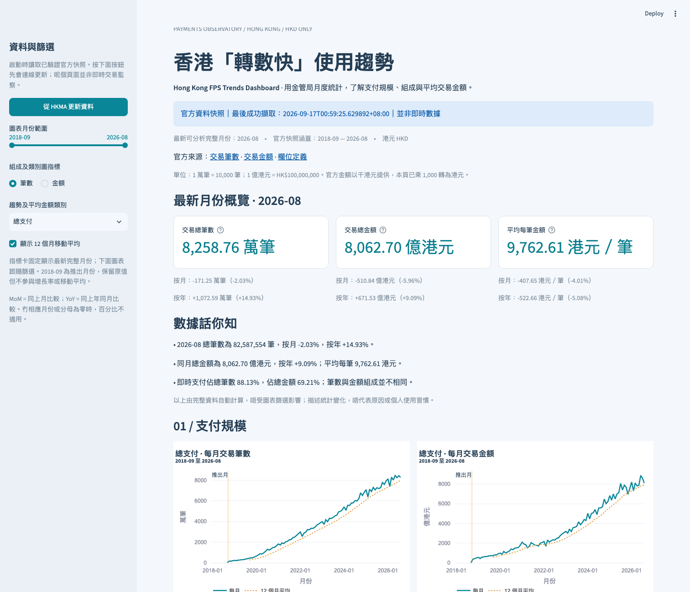

# Hong Kong FPS Trends Dashboard

**An interactive dashboard exploring Hong Kong dollar payment trends in the Faster Payment System (FPS), built from two official HKMA APIs with a reproducible data pipeline.**

Python · pandas · Streamlit · Plotly | HKD only | 96 months | 19 automated tests

[](https://github.com/CardiFfung/hong-kong-fps-dashboard/actions/workflows/tests.yml)

[GitHub repository](https://github.com/CardiFfung/hong-kong-fps-dashboard)



> The dashboard interface and charts are in Traditional Chinese. The local application has been tested; a public interactive demo has not yet been deployed. The findings below use the official data snapshot retrieved on 17 September 2026 at 00:59 HKT.

## Project Highlights

- **Official data integration:** Retrieves paginated HKMA data, merges transaction volume and value by month, and performs cleaning and quality checks.
- **Interactive trend analysis:** Presents payment scale, transaction composition, and average transaction value through clearly defined metrics, filters, charts, and CSV exports.
- **Traceable data processing:** Preserves raw snapshots, source URLs, and retrieval timestamps, with explicit data-status messages when an API update fails.

## Research Questions

1. How have monthly HKD FPS transaction volume and value changed since launch?
2. How does the latest complete month compare with the previous month and the same month a year earlier, in both absolute and percentage terms?
3. What shares of total transaction volume and value come from real-time and batch payments?
4. What shares of total real-time credit transfers (`rtctp`) come from payments initiated by personal accounts using payee proxy IDs or account numbers?
5. How has average transaction value changed within each payment category?

## Key Findings

These findings were calculated from the 17 September 2026 snapshot, with August 2026 as the latest available month. The dashboard recalculates its findings after a data update; this README records a dated analysis.

1. **August 2026 recorded 82,587,554 transactions**, down **2.03% month over month** and up **14.93% year over year**.
2. **Total transaction value was HK$806.27 billion**, up **9.09% year over year**, with an **average of HK$9,762.61 per transaction**.
3. **Real-time payments accounted for 88.13% of transaction volume but 69.21% of transaction value**, showing that the two measures describe different aspects of the payment mix.

These are descriptive findings, not explanations of causality. Between October 2018, the first full month after launch, and August 2026, monthly volume increased from 1,682,647 to 82,587,554 transactions, while value increased from approximately HK$35.98 billion to HK$806.27 billion. The charts retain the intervening fluctuations rather than implying uninterrupted monthly growth.

## Installation and Usage

Use **Python 3.13**; the local application was tested with Python 3.13.14. Run the commands below from the project directory.

To download a new copy:

```bash
git clone https://github.com/CardiFfung/hong-kong-fps-dashboard.git
cd hong-kong-fps-dashboard
```

Create a virtual environment, install dependencies, and start the dashboard on macOS or Linux:

```bash
python3 -m venv .venv
source .venv/bin/activate
python -m pip install -r requirements.txt
python -m streamlit run app.py
```

Open `http://localhost:8501` in your browser. If the local virtual environment is already configured, activate it and run the final command. On macOS, you can also double-click `Start Dashboard.command` after completing the environment setup.

On Windows, create the environment with `py -3.13 -m venv .venv`. Activate it using `.venv\Scripts\activate.bat` in Command Prompt or `.venv\Scripts\Activate.ps1` in PowerShell, then run the same installation and startup commands.

The repository includes genuine official data snapshots, so startup does not require a live API connection. To retrieve fresh data:

```bash
python -m src.pipeline
```

Alternatively, use the HKMA data-update button in the dashboard sidebar. Each update retrieves all available months from both sources, retains a new snapshot, and makes it active only after validation succeeds. Updates are manual; no automatic schedule is configured. If an API update fails, the dashboard displays an error and the previous snapshot's retrieval date. Without a valid snapshot, it stops rather than displaying fabricated metrics.

## Data Sources and Definitions

- [HKMA HKD FPS volume API](https://api.hkma.gov.hk/public/market-data-and-statistics/monthly-statistical-bulletin/banking/ch-statistics-turnover-fps-hkd-payment-vol): Number of transactions.
- [HKMA HKD FPS value API](https://api.hkma.gov.hk/public/market-data-and-statistics/monthly-statistical-bulletin/banking/ch-statistics-turnover-fps-hkd-payment-val): **Values are reported in HKD thousands and must be multiplied by 1,000 to obtain HKD.**
- [Data audit](docs/DATA_AUDIT.md): Field definitions, coverage, pagination, quality checks, official documentation links, and evidence from the API responses.

The two datasets are merged one-to-one by month, with `_volume` and `_value_hkd_thousand` suffixes distinguishing their original fields. Average transaction value is calculated as:

```text
Average value in HKD = value in HKD thousands × 1,000 ÷ transaction volume
```

Both inputs must refer to the same month and category. Missing values or zero transaction volume produce no average. Month-over-month (MoM) and year-over-year (YoY) growth require the exact previous month or same month of the previous year; percentage changes are undefined when the baseline is zero.

Total payments comprise real-time payments and batch payments. Real-time payments comprise real-time credit transfers and real-time direct debits. Totals must not be added to their own components. The primary denominator for personal-account transfer shares is `rtctp`, which includes other real-time credit transfers.

The Traditional Chinese dashboard displays volume in units of 10,000 transactions and value in units of HK$100 million. These display units differ from the billions used in this README, but represent the same underlying values.

## Dashboard Features

- A month-range slider filters charts and CSV exports; category selection controls the volume, value, and average-value trend charts.
- A volume/value selector controls payment-mode shares and transfer-subcategory comparisons.
- The headline metrics and three generated findings always refer to the latest complete month in the full dataset, independently of chart filters.
- Five charts distinguish transaction counts, monetary values, shares, and averages, with guidance on interpretation and limitations.
- CSV exports follow the selected month range and include all categories and both measures. Raw data, processed data, and presentation code are kept separate.

## Project Structure

```text
app.py                      Interface, filters, charts, downloads, and error states
src/pipeline.py             API retrieval, pagination, cleaning, merging,
                            validation, and all derived calculations
requirements.txt            Pinned runtime dependencies
requirements-dev.txt        Testing tools
requirements-lock.txt       Full local dependency versions
data/current.json           Pointer to the latest successful snapshot
data/raw/<snapshot>/        Original responses and per-page request URLs
data/processed/<snapshot>/  fps.csv and metadata.json
tests/                      Pipeline, application, and browser checks
docs/                       Screenshots, data audit, QA, deployment,
                            CV wording, and interview notes
LEARNING_NOTES.md            Beginner learning guide in Cantonese/Traditional Chinese
```

## Validation

```bash
python -m pip install -r requirements-dev.txt
python -m pytest -q
python -m src.pipeline --offline
```

All **19 automated tests passed**, covering unique months, missing months, unit conversion, zero denominators, launch-month exclusions, share denominators, reconciliation reporting, pagination, API failures, snapshot preservation, and interface filtering.

Independent calculations using `Decimal` were checked against the official snapshot. Browser checks in Chromium verified the five charts, CSV downloads, and the mobile layout. See the [QA report](docs/QA_REPORT.md). GitHub Actions also [passed on Ubuntu with Python 3.13](https://github.com/CardiFfung/hong-kong-fps-dashboard/actions/runs/35129351241) on 17 September 2026.

## Data Limitations

- **HKD only:** Aggregate monthly statistics do not identify individual users, unique user counts, transaction purposes, or demographics.
- **Partial launch month:** FPS was fully launched on 30 September 2018. September 2018 may represent only a partial month; it is marked on charts and excluded from growth comparisons and moving averages.
- **Averages are not medians:** Large transactions and changes in the payment mix can influence the mean, which does not necessarily describe a typical person's transaction.
- **No causal claims:** Month length, holidays, and other factors may affect totals. This project does not apply seasonal adjustment, causal modelling, or forecasting.
- **Revisions are possible:** A completed calendar month is not necessarily final. Snapshots retain retrieval times, source URLs, and checksums.
- **Missing data remain missing:** Nulls are not replaced with zero. Reconciliation differences are reported without altering official values. Headline metrics require both monthly totals to be available.
- **Cloud storage is not guaranteed:** Files written during a hosted session may be lost after a restart. Persistent storage or updated repository snapshots would be needed for durable cloud updates.

## Learning Takeaways

Clear denominators and consistent units are essential to meaningful analysis. Sorting months does not guarantee a continuous monthly series, and missing data should not be disguised as zero. A reproducible pipeline and preserved source snapshots make the results easier to verify.

The initial implementation was developed with AI assistance. The [learning notes](LEARNING_NOTES.md) provide exercises for rerunning the pipeline, checking calculations, and understanding the design decisions before describing personal contributions.

## Further Documentation

The supporting learning and presentation guides remain in Traditional Chinese.

- [CV and LinkedIn descriptions](docs/CV_LINKEDIN.md)
- [10-minute project presentation outline](docs/INTERVIEW_OUTLINE.md)
- [Public demo deployment guide](docs/DEPLOYMENT.md)

This is an independent learning project using HKMA data, not an official HKMA product. Retain source attribution and consult the official terms of use when redistributing the data.
